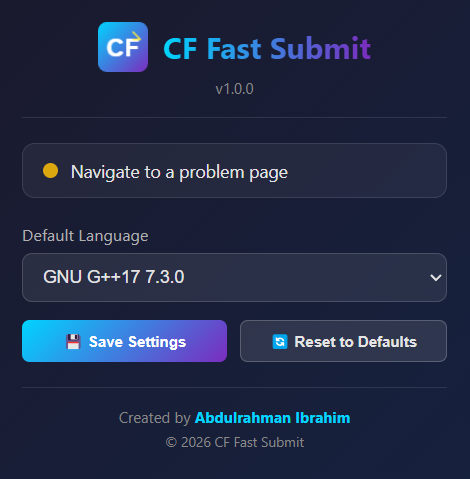
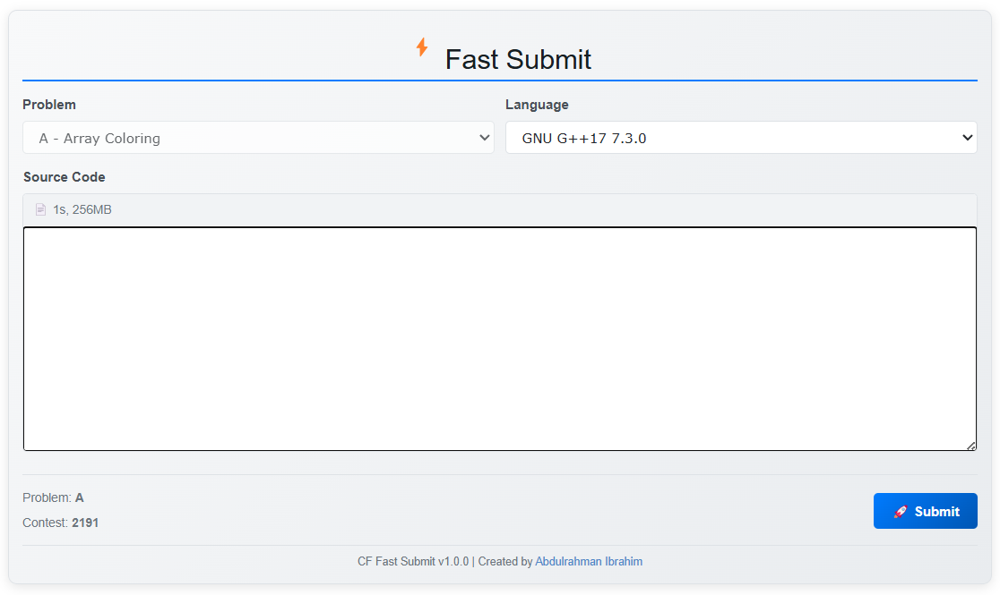

# CF Fast Submit

A browser extension for fast code submission on Codeforces.

## Preview

## Author

**Abdulrahman Ibrahim** - [GitHub](https://github.com/abdo-ibrahim)

## Features

- Submit code directly from the problem page
- Built-in code editor with syntax highlighting
- Supports contests, gyms, problemset, and group contests
- Set default programming language

## Installation

1. Open `chrome://extensions/` (Chrome) or `brave://extensions/` (Brave)
2. Enable **Developer mode**
3. Click **Load unpacked**
4. Select the `cf-fast-submit` folder

## Usage

1. Go to any Codeforces problem page
2. Find the **Fast Submit** form below the problem
3. Write your code and select language
4. Click **Submit**

## Supported Pages

- `codeforces.com/contest/*/problem/*`
- `codeforces.com/gym/*/problem/*`
- `codeforces.com/problemset/problem/*/*`
- `codeforces.com/group/*/contest/*/problem/*`

## License

MIT
